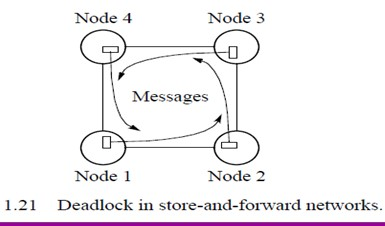
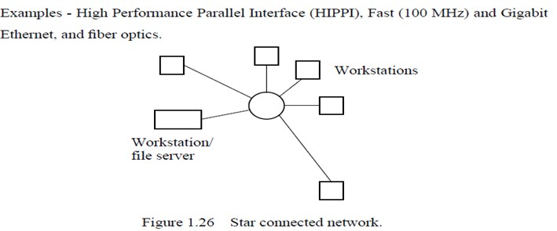
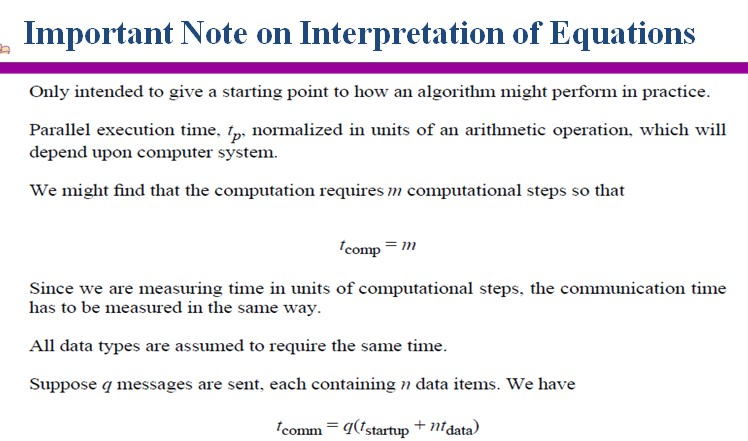

## L1
### Grand challenge problems
* large DNA structures, global weather forcasting, motion of astronomical bodies
### Shared Memory Multiprocessor Systems
#### Parallel programming languages
* with special parallel programming constructs and statements that allow shared variables and parallel code sections to be declared.
#### Threads
* high-level language code sequences for individual processors
### Message Passing Multiprocessor Systems
* messages processor
* local memory
* interconnection network
### SISD (Flynn分类法)
* calles this single processor Single Instruction Stream-Single Data Stream (SISD)
    * 所有指令都是串行执行，CPU只能处理一个数据流

* Multiple Instruction Stream-Multiple Data Stream (MIMD)
* Single Instruction Streaming-Multiple Data Streaming (SIMD)
    * multiple processors. Each processor executes the same instruction **in synchronism**, but using different data

#### Multiple Program Multiple Data Streaming (MPMD) Structure
* each processor will have its own program to execute

### Single Program Multiple Data (SPMD) Structure
* Single source program is written, each processor will execute its personal copy of this program
* **not in synchronism**
### Message-Passing Multicomputers
* static network message-passing multicomputers

* node with a switch for internode message transfters

* link between two nodes with separate wires in each direction

### Network Criteria

#### Embdding
* describes mapping nodes of one network onto another network
* dilation - used to indicate the quality of embdding, is the maximum number of links in the "embedding" network corresponding to one link in the "embedded" network
    * 详见sub4.pdf

### Communication Methods
#### Circuit Switching
* establishing path and maintaining all links in path for message to pass. All links are reserved for the transfer until message transfer is complete.
* e.g. simple telephone system: once a telephone connection is made, the connection is maintained until the completion of the telephone call
#### Packing Switching
* Message divided into "packets" of information, each of which includes source and destination addresses for routing packet through interconnection network. 
* If message is larger than maximum size for the packet (e..g 1000 data bytes), more than one packet must be sent through network. 
* Buffers provided inside nodes to hold packets before they are transferred onward to the next node
* *store-and-forward packet switching*
* e.g. mail system. letters moved from mailbox to post office and handled at itermediate sites before delivered to destination
#### Virtual Cut-Through
* eliminated storage latency
* if outgoing link is available, the message is immediately passed forward without being stored in the nodal buffer; if path is blocked, storage is needed for complete message/packet being received.
#### Wormhole Routing
* message divided into smaller units called flits (flow control digits)
* Only head of message initially transmitted from source node to next node when connecting link available. Subsequent flits of message transmitted when links become available.

### Deadlock
* Occurs when packets can't be forwarded to next node because they are blocked by other packets waiting to be forwarded and these packets are blocked in a similary way such that none of the packets can move
* e.g.

#### Solution 1: Virtual Channel
* Multiple *virtual* channels are associated with a physical channel and time-multiplexed onto the physical channel

### Network
#### Ring Structures

#### Point-to-Point Communication
* Provides the highest interconnection bandwidth

#### Overlapping Connectivity Networks
* e.g.

### Speedup Factor
* Maximum speedup is n with n processors (linear speedup)

#### Amdahl's Law
* $S(n) =$ ${t_s}\over {ft_s + (1-f)t_s/n} $ $=$ $ {n} \over {1+(n-1)f}$
#### Efficiency
* $E = \frac {Execution time using one processor} {Execution time using a multiprocessor \times number of processors} = \frac {t_s} {t_p \times n} = \frac {S(n)} {n} \times 100%$
### Cost
* $Cost = (execution time) \times (total number of processors used) = \frac {t_sn}{S(n)} = \frac {t_s} {E}$
    * $t_s$ is the execution time of a sequential computation

    * $t_p \times n$ is the cost of a parallel computation

#### Scalability
* architecutre scalability: a hardware design that allows the system to be increased in size and in doing so to obtain increased performance
* algorithmic scalability: a parallel algorithm can accommodate increased data items with a low and bounded increase in computational steps
#### Gustafson' Law
* $S_s(n) = \frac {s+np}{s+p} = s+np = n+(1-n)s$
* e.g. serial section of 5% and 20 processors. 0.05+0.95(20) = 19.05

## L2 Message Passing Computing and Programming
### Single Program Multiple Data Model (SPMD)
* Different processes are merged into one program. 
### MPMD Model
* Separate program written for each processors. Master-slave approachusually taken whereby a single processor executes a master process and other processes are started from within the master process
### Synchronous Message Passing
* Routines that actually return when the messages transfer has been completed
* Do not need message buffer storage.
* A synchronous send routine could wait until the complete message can be accepted by the receiving process before sending the message
* A s receive routine will wait until the message it is expectig arrives.
### Blocking and Nonblocking Message Passing
#### Blocking
* has been used to describe routines that do not return until the transfer is completed
* *synchronous* and *blocking* were synonymous
* In MPI, it is: return after their local actions complete, though the message transfer may not have been completed
#### Non-blocking
* routines that return whether or not the message had been received
* In MPI, return immediately. 
* How message-passing routines can return before the message transfer has been completed
    * generally, a message buffer needed between source and destination to hold message

    * for send routine, once the local actions have been completed and the message is safely on its way, the process can continue with subsequent work.

    *    Buffer 长度一定，满了之后，send routine is held up

### Functions
#### Message Tag
* If special type matching is not required, a *wild card* message tag is used, so that the rece() will match with any send()
* e.g. message x with tag 5. The message tag is carried within the message
    * $send(&x,2,5)$

    * $recv(&y,1,5)$

#### Broadcast
* sending the same message to all the processes concerned with the problem

#### Scatter
* sending each element of an array of data in the root to a separate process. ith location of array is sent to ith process

#### Gather
* having on process collect individual values from a set of processes

#### Reduce
* gather operation combined with a specified arithmetic or logical operation
### Parallel Virtual Machine (PVM)
* Provides for a software environment for message passing between homogeneous or heterogeneous computes and has a collection of library routines that the user can employ with C or FORTRAN programs
* the set of computers used on a problem first must be defined prior to running the programs
* 最方便的方法是 creating a list of the names of the computers available in a  *hostfile*. The hostfile is then read by PVM
* Routing of message between computers is done by PVM daemon processes installed by PVM on the computers that form the virtual machine

### Basic Message-Passing Routines
* All PVM sending routines are nonblocking, receive routines can be either blocking or nonblocking
* If data being sent is a list items of the same data type, the PVM routines $pvm_psend()$ and $pvm precv()$ can be used

* broadcast, scatter, gather, and reduce operations (pvm_bcast(),pvm_scatter()...)use group of processes
* the PVM multicast operation, pvm_mcast(), is not a group operation
### MPI
* Only static process creation is supported in version 1. Use SPMD model of computation.
#### Communication
* communicators: is a *communication domain* that defines a set of processes that are allowed to communicate between themselves
* Types
    * intracommunicator: for communication within a group

    * intercommunicator: for communication between groups

* A process has unique rank in a group, and it could be a member of more than one group
#### Point-to-Point Communication
* Blocking Routines
    * A blocking send will send the message and return. This does not mean the message has been received, just the process is free to move on without adversely affecting the message
    * MPI_Send(buf, count, datatype, dest, tag, comm)

    * MPI_Recv(buf, count, datatype, src, tag, comm, status)

* Nonblocking Routines
    * send: will return "immediately" even before source location is safe to be altered. 

        * MPI_Isend (buf, count, datatype, dest, tag, comm, request)

    * receive: will return even if there is no message to accept
        * MPI_Irecv(buf, count, datatype, source, tag, comm, request)

    * Completion detected by MPI_Wait() and MPI_Test()

#### Send Communication Modes

#### Collective Communication
* Involves set of processes, defined by an intra-communicator
### Time Complexity of MPI Program
#### Parallel Execution Time
* two parts: a computation part, and a communication part
* $t_p = t_{comp}+t_{comm}$
#### Communication Time
* $t_{comm} = t_{startup}+nt_{data}$
    * $ t_{startup}$ is startup time, sometimes called message latency, assumed constant

    * $t_{data}$ is transmission time to send data word, also assumed a constant

#### Cost Optimal Algorithms

### Time Complexity of Broadcast
#### on a Hypercube Network

#### on a Mesh Network

#### on a Workstation Cluster

#### Gather on a Hypercube Network

