## L3 S8 Multithreaded Programming
### Several Althernatives for Programming
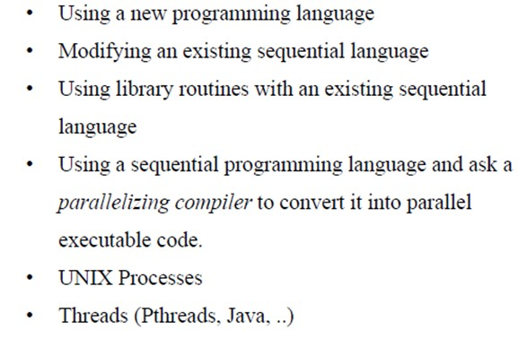
### UNIX Heavyweight Process
* The UNIX system call *fork()* creates a new process which is an *exact copy* of the calling process except that it has a unique process ID.
* *wait(startup)*  delays caller until signal received or one of its child processes terminates or stops
* *exit(status)* terminates a process
### Thread
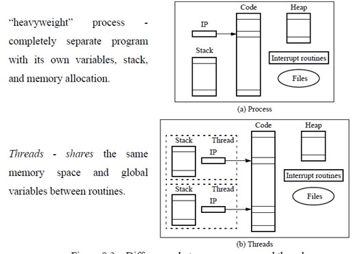
#### Detached Threads
* It may be that thread may not be bothered when a thread it creates and in that case a join not be needed. Threads that are not joinned are called detached threads
* 主线程死了，子线程也会死，除了detached
#### Thread-Safe Routines
* System calls or library routines are called *thread safe* if they can be called from multiple threads simultaneously and always produce correct results.
* The thread-safety aspect of any routine can be avoided by forcing only one thread to execute the routine at a time. This could be achieved by simply enclosing the routine in a critical section but this is very inefficient.
#### Critical Section
* A mechanism for ensuring that only one process accesses a particular resource at a time is to establish sections of code involving the resource as so-called critical sections.
* *mutal exclusion*
#### Locks
* Simplest, 1-bit.
* 1: a process has entered the critical section. 0: no process is in the critical section.
#### Deadlock
* Two process
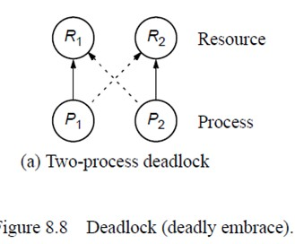
* n-process
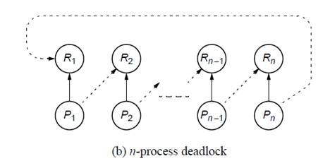
### Semaphore 信号
* *s* is a positive integer (including zero)
* Process delayed by P(s) are kept in abeyance until released by a V(s) on the same semaphore
#### P operations, P(s)
* wait until s is greater than zero and then decrements s by one and allows process to continue
#### V operation, V(s)
* increments s by one to release one of the waiting processes (if any)
#### General Semaphore
* Semaphore routines exists for UNIX processes, they don't exist in Pthreads as such, though they can be written and they do exist in the real-time extension to Pthreads
* Reading and writing can only be done by using a monitor procedure, and only one process can use a monitor procedure at any instant.
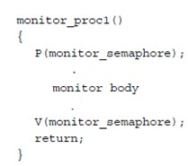
### Condition Variables
#### Operations
* $wait(cond\_var)$ - wait for a condition to occur
* $singla(cond\_var)$ - signal that the condition has occurred
* $status(cond\_var)$ - return the number of processes waiting for the condition to occur
###Language Constructs for Parallelism
* Shared memory variables: `shared int  x`
* for specifying concurrent statements: `par{ code }`
* 类似于openMP的for loop `forall (i=0;i<n;i++){ code }`
### Berstein's Conditions
* Set of conditions that are sufficient to determine whether two proceses can be executed simultaneously.
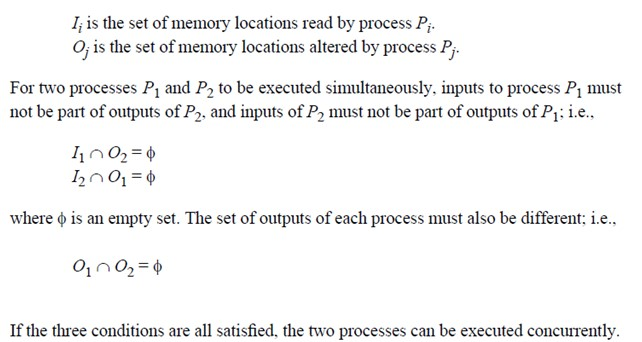
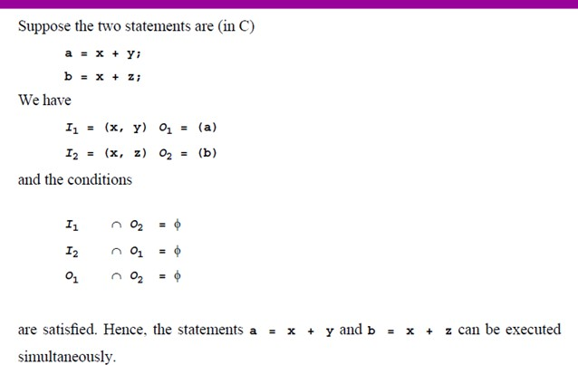
### Shared Data in System with Caches
#### Cache coherence protocols
* *update policy*: copies of data in all caches are updated at the time one copy is altered
* *invalidate policy*: when one copy of data is altered, the same data in any other cache is invalidated. These copies are only updated when the associated processor makes reference for it.
#### (2)
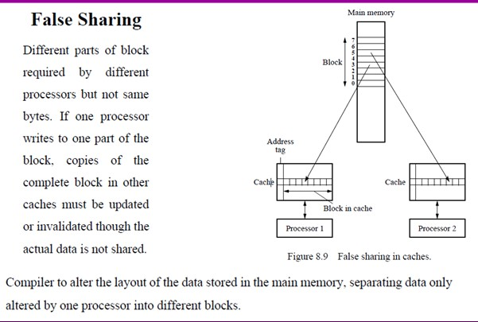

## L4 Quinn Shared-memory Programming
### OpenMP
### Shared-memory model
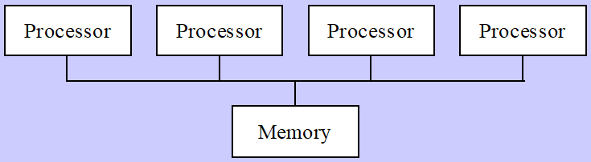
#### Fork/Join Parallelism
* Initially only master thread is active. 
#### Shared-memory Model vs. Message-passing Model
* shared-memory model
    * number active threads 1 at start and finish of program, changes dynamically during execution

    * incrementally make it parallel

* message-passing model
    * all processes active throughout execution of program

    * sequential-to-parallel transformation requires major effort
#### Incremental Parallelization
* process of converting a sequential program to a parallel program a little bit at a time
* sequential is a special case of shared-m
### Parallel for loops
* Compiler takes care of generating code that forks/joins threads and allocates the iterations to threads
#### Pragma
* A compiler directive in C or C++. Stands for "pragmatic information"
* `#pragma omp <rest of pragma>`
#### Execution Context
* Every thread has its own execution context (address space containing all of the variables a thread may access)
* Includes:
    * static variables

    * dynamically allocated data structures in the heap

    * variables on the run-time stack

    * additional run-time stack for functions invoked by the thread
### Declaring private varibales
* Private clause: directs compiler to make one or more variables privte
    * `private (<variable list>)

* e.g.
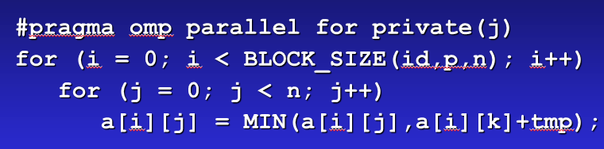
#### firstprivate clause
* Variables are initialized once per thread, not once per loop iteration
* 用于继承同名变量的值-并行区域之外的变量的值，进行一次初始化
* If a thread modifies a variables's value in an iteration, subsequent iterations will get the modified value
* e.g.
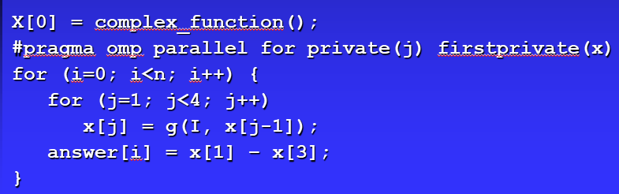
#### lastprivate clause
* sequentially last iteration: iteration that occurs last when the loop is executed sequentially
* used to copy back to the master thread's copy of a variable the private copy of the variable from the thread that executed the sequentially last iteration.
* 将值赋予同名的共享变量，sequential的最后一次那个
### Critical sections
#### Race Condition
#### Critical Pragma
* Critical section: a portion of code that only thread at a time may execute. like mutex
* `#pragma omp critical`
* e.g. (correct, but inefficient code)
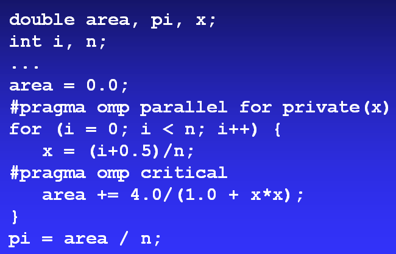
### Reductions
* `reduction (<op>:<variable>)`
    * op: +, *, bitwise and, bitwise or, bitwise exclusive or, logical and, logical or 
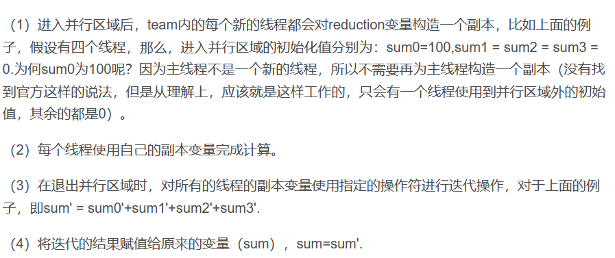
### Performance improvements
* Too many fork/joins can lower performance
* If look has too few terations, fork/join overhead is greater than time savings from parallel execution.
    * `#pragma omp parallel for if(n>500)`

* `schedule`
    * static schedule: all iterations allocated to threads before any iterations executed

        * low overhead, may exhibit workload imbalance

    * dynamic schedule: only some iterations allocated to threads at beginning of loop's execution. Remaing iterations allocated to threads that complete their assigned iterations.

        * higher overhead; can reduce workload imbalance

#### Chunks
* A chunk is a contiguous range of iterations
* Increasing chunk size reduces overhead and may increase cache hit rate.
* Decreasing chunk size allows finer balancing of workloads
* `schedule (<type>[,<chunl.])`
#### Scheduling options
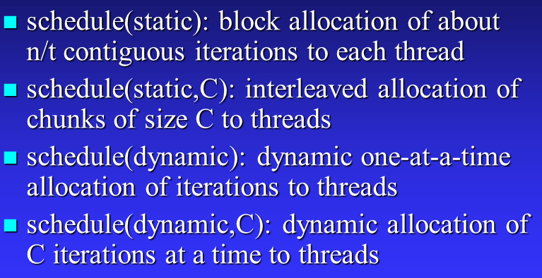
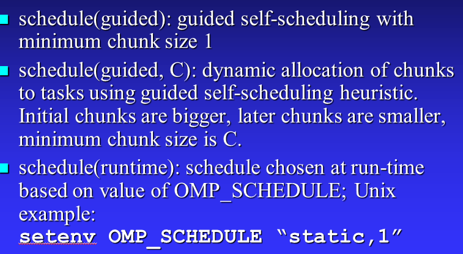
### More general data parallelism
#### Functions for SPMD-style Programming
* `int omp_get_thread_num(void)` return thread identification number
* `int omp_get_num_threads(void)` return the number of active threads
#### nowait Clause
* Compiler puts a barrier synchronization at end of every parallel for statement.
### Functional parallelism
#### parallel sections pragma
* `pragma omp parallel sections`
* e.g. 
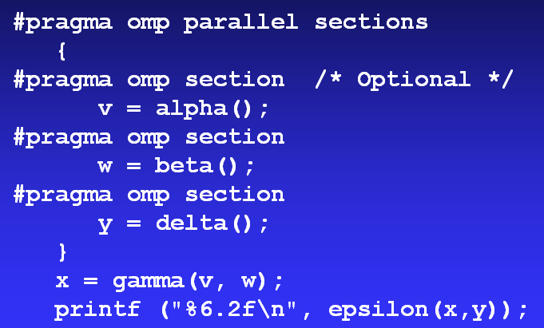

