## L5 - S3 Embarrassingly Parallel Computations
### Embarrassingly Parallel Computations 易并行运算
* A computation that can be divided into a number of completely independent parts, each of which can be executed by a separate processor. 
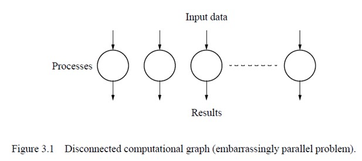
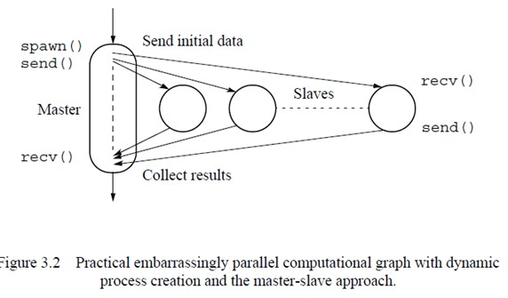
#### Example - low level image operations
* Shifting  Scaling  Rotation
* time complexity
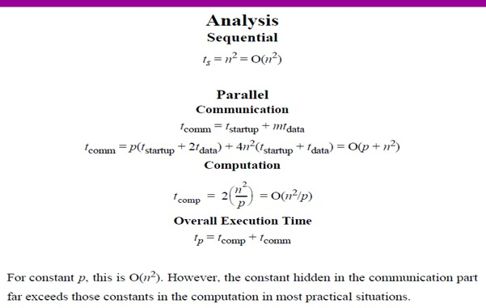
#### Example - Mandelbrot Set Computation
* analysis
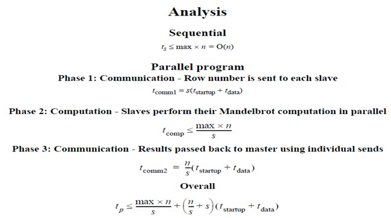
#### Example - Monte Carlo Method   anyway
* 随机
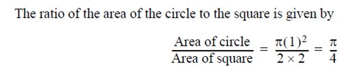

## L6 -S4 Partitioning and Divide-and-Conquer Strategies
### Example - Adding a Sequence of Numbers
#### 普通方法
* Dividing sequence into m parts added independently to create partial sums.
* Using separate  send() and recv()
    * master 挨个send数据，slave接收、计算、send结果给master，repeat
* Using Broadcast/Multicast Routines
    * master一起bcast，......，
*  Using Scatter and Reduce Routines
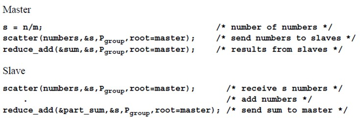
* Analysis
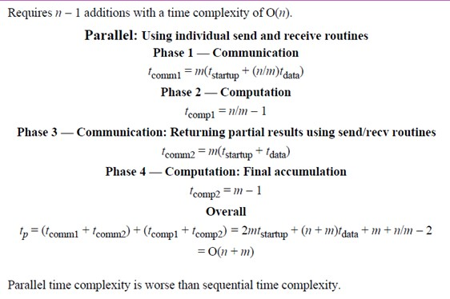
#### Divide and Conquer
* 拆分为subproblem， recursive
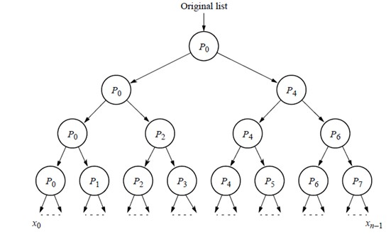
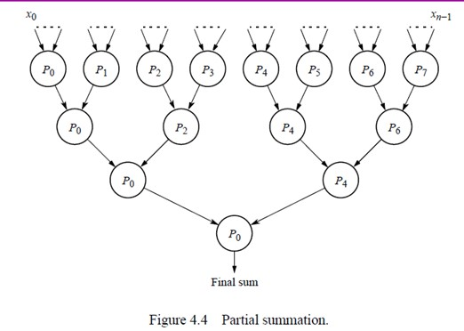
* implementation
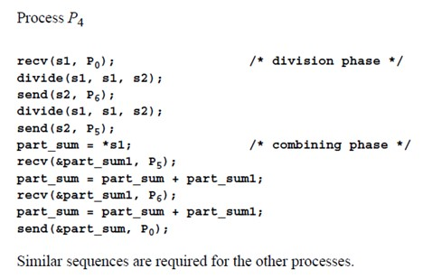
* Analysis
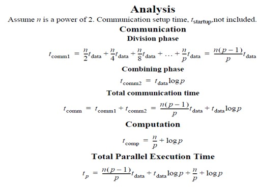
#### M-array Divide and Conquer
* 之前divide into 2 parts， 现在比如divide into 4 parts
### Examples - Sorting Using Bucket Sort
* range of number is divided into *m* equal bucket， 桶内排序，再merge
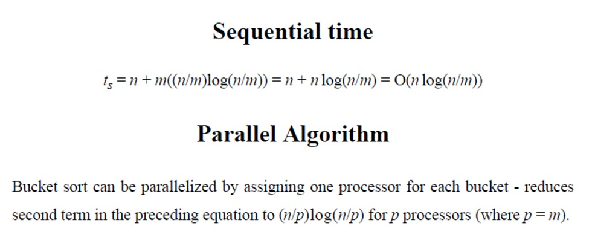
* 类似于odd-even sort
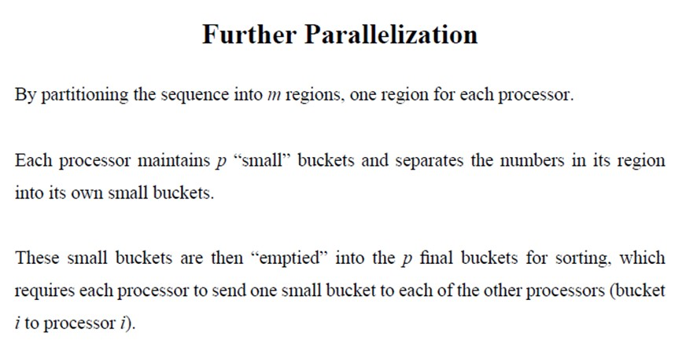
* Analysis
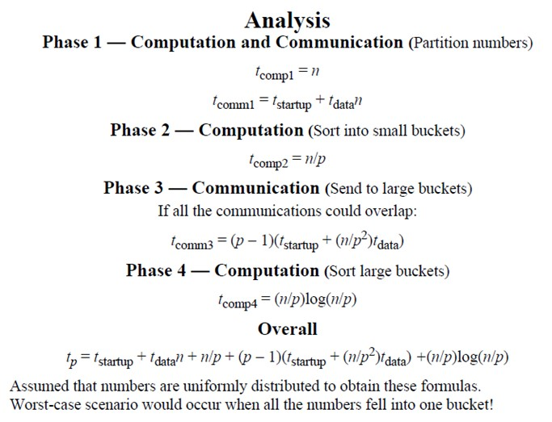
* "all-to-all" routine could be used for Phase 3 -sends data from each process to every other process
    * 按照顺序接收，P0发给其他的index 0

### Numerical Integration
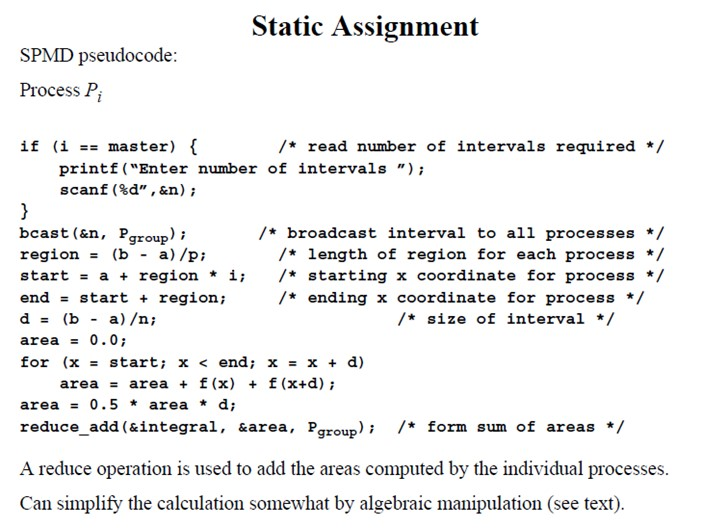
### Gravitational N-Body Problem
#### Barnes - Hut Algorithm
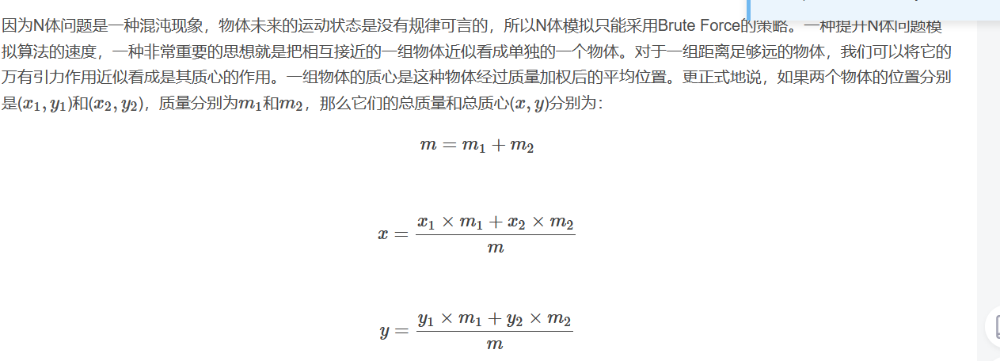
