## L7 - S5 Pipelined Computations 
什么辣鸡？？
### Pipeline Computations
* In the pipeline technique, the problem is divided into a series of tasks that have to be completed one after the other.
### Three Types of Pipelined Computations
* Given that the problem can be divided into a series of sequential tasks, the pipelined approach can provide increased speed under the following three types of computations
#### Type -1
* If more than one instance of the complete problems is to be executed

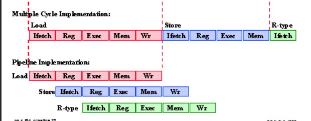
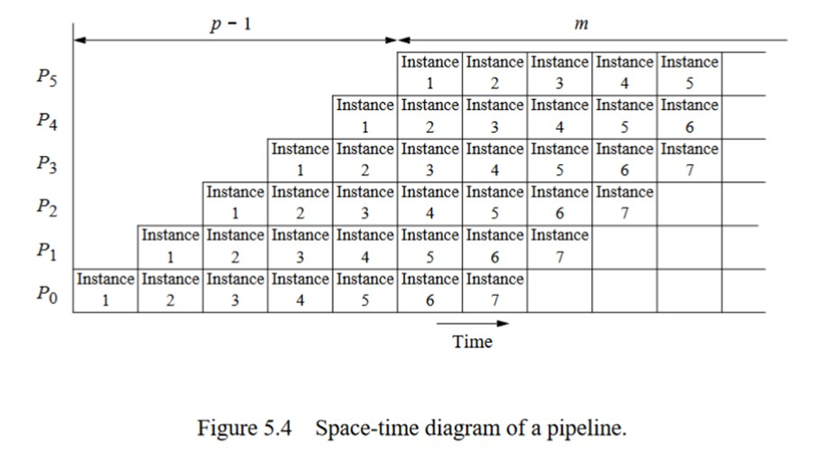
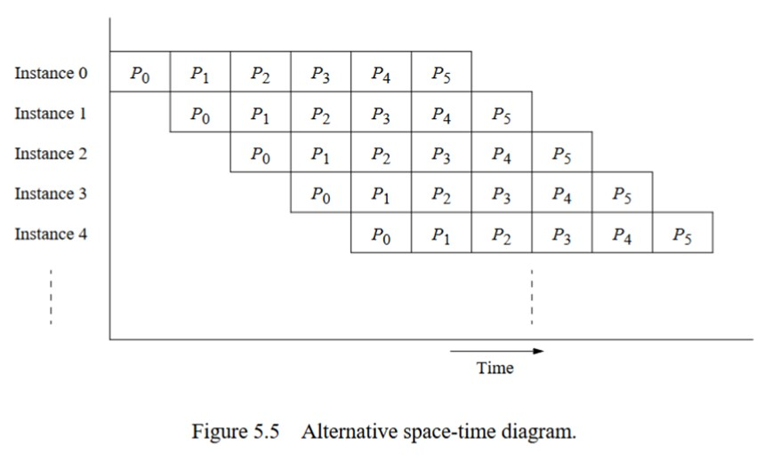
* Analysis
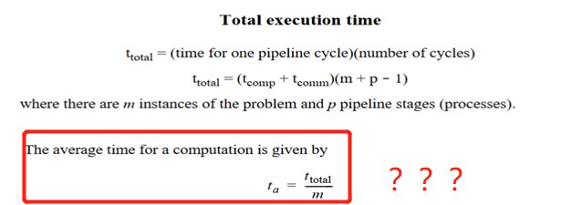
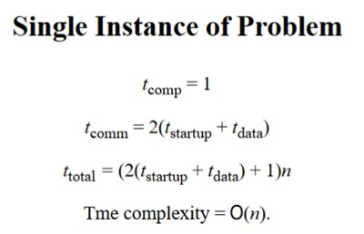
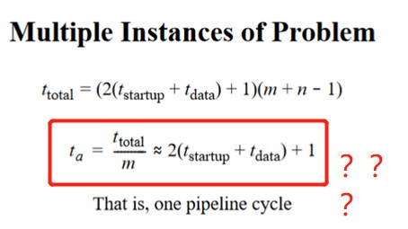
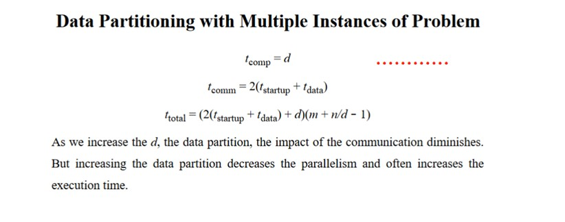
#### Type - 2
* If a series of data items must be processed, each requiring multiple operations

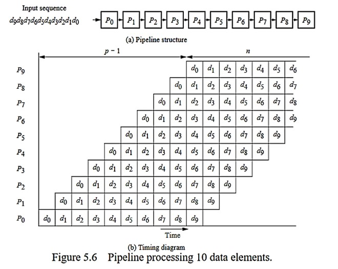
#### Type - 3
* If information to start the next process can be passed forward before the process has completed all its internal operations

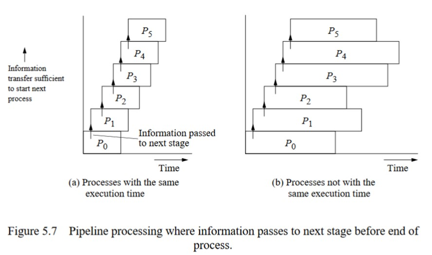
### Partitioning of Pipelined Computations
* If the number of stages is larger than the number of processors in any pipeline, a group of stages can be assigned to each processor
#### Pipeline Program Examples - Adding Numbers
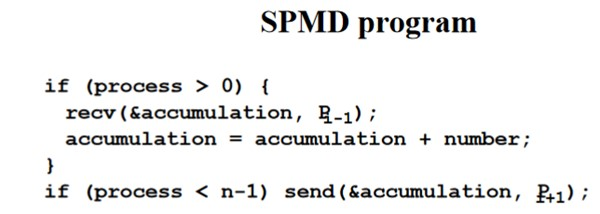
### Sorting Numbers
* basic algorithm
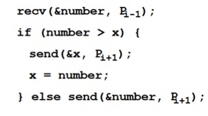
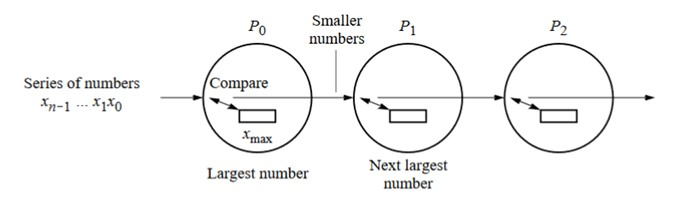
### Prime Number Generation

## L8 - S6 Synchronous Computations
### Synchronous Computations
* In a (fully) synchronous application, all the processes synchronized at regular points.
#### MPI
* `MPI_Barrier()` with a named communicator
#### PVM
* `pvm_barrier()` with a named group of processes
    * unusual features: specifying the number of processes that must reach the barrier to release the processes

#### Counter Implementation
* centralized counter implementation (sometimes called a *linear barrier*)
* two phases: 
    * arrival phase (does not leave the phase until all processes have arrived), and 
    * departure phase (are released)
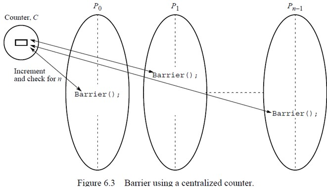

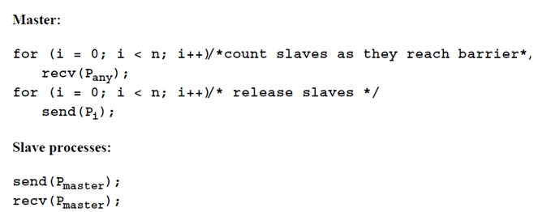
#### Tree Implementation
* suppose 8 processes.
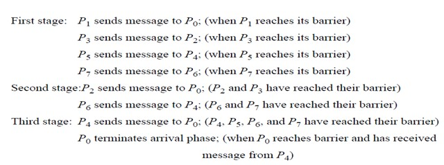
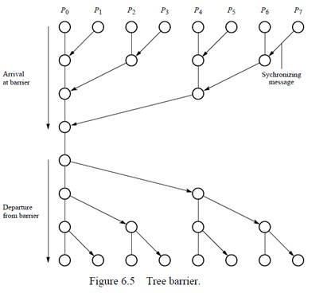
#### Bufferfly Barrier
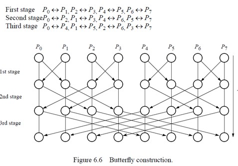
#### Local Synchronization
* $P_{i-1}4 will only synchronize with $P_i$, $P_{i+1}$, too
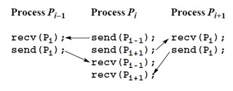
#### Deadlock
* It will occur if both processes perform the send, using synchronous routines first (or, blocking routines without sufficient buffering). This because neither will return, they will wait for matching receives that are never reached
* Solution
    * arrange for one process to receive first and then send and other process to send first and then receive.

#### Combined deadlock-free blocking sendrecv() routines
* `MPI_Sendrecv()`
#### Data Parallel Computations
* Same operation performed on different data elements simultaneously.
### Forall Construction
* `forall (i = 0; i < n; i++) {code}`
    * n instances of the statements of the body can be executed simultaneously

### Prefix Sum Problem
* sequential code
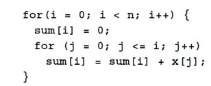
#### Data parallel method of adding all partial sums of 16 numbers
* 用`forall`
### Synchronous Iteration (Synchronous Parallelism)
* Each iteration composed of several processes that start together at beginning of iteration and next iteration can't begin until all processes have finished previous iteration.
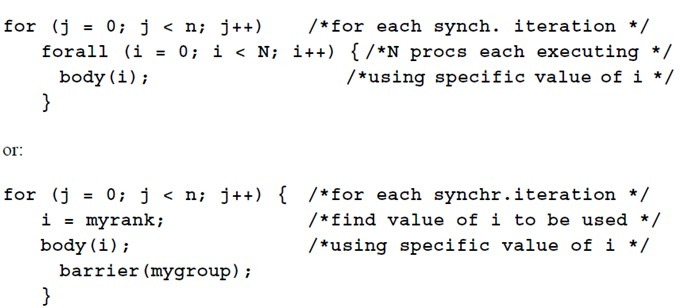
#### Safety and Deadlock
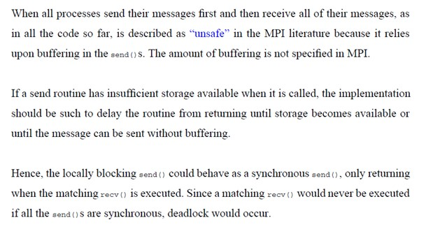
### Make the code safe
#### 分为奇偶myid决定send和recv的顺序
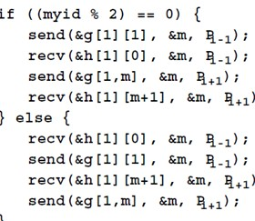
#### MPI Safe message Passing Routines
* `MPI_Sendrecv()`
* `MPI_Bsend()` buffered, provides explicit storage
* `MPI_Ised()` `MPI_Irecv()` nonblocking, returns immediately, 配合`wait`等使用
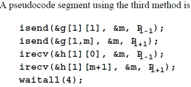
### Cellular Automata
* Problem space is first divided into cells, each cell can be in one of a finite number of states.
* Cells are affected by their neigbors according to certain rules, and all cells are affected simultaneously in a "generation"

