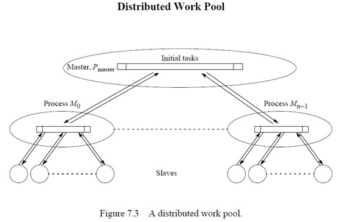

## L9 -S7 Load Balancing and Termination Detection
* Load balancing: used to distribute computations fairly across processors in order to obtain the highest possible execution speed.
* Termination detection: detecting when a computation has been completed. More difficult when the computation is distributed
#### Load-balancing techniques
* round robin algorithm: passes out tasks in sequential order of processes coming back to the first when all processes have been given a task
* randomized algorithms: select processes at random to take tasks
* recursive bisection: recursively divides the problem into subproblems of equal computational effort while minimizing message passing
* simulated annealing: an optimization technique
* genetic algorithm: another optimization technique, described in chapter 12.
### Processes and Processors
* Processes are mapped onto processors. Our objective is to keep the processors busy.
### Dynamic Load Balancing
* During the execution of the processes. All previous are taken into account by making the division of load dependent upon the execution of the parts as they are being executed.
#### Centralized dynamic LB
* Tasks are handed out from a centralized location. A clear master-slave structure exists.
* Master(s) holds the collection of tasks to be performed.
* Term: *work pool, relicated worker, processor farm*
* Termination
    * When tasks are taken from a task queue, computation terminates when:

        * the task queue is empty **and**

        * every process has made a request for another task without new tasks being generated

#### Decentralized dynamic LB
* Tasks are passed between arbitrary processes.
* A worker process may receive tasks from other worker processes and may send tasks to others.
* A collection of worker processes operate upon the problem and interact among themselves, finally reporting to a single process.

* Fully Distributed Work Pool

### Task Transfer Mechanisms
#### Receiver Initiated Method
* A process requests tasks from other processes it selects.
* It has been shown to work well at high system load. But, it can be expensive to determine process load.
#### Sender Initiated Method
* A process sends tasks to other processes it selects.
*  It has been shown to work well for light overall system loads.
#### Task Transfer Mechanisms
* Round robin algorithm: process $P_i$ requests tasks from process $P_x$, where x is given by a counter that is incremented after each request, using modulo n arithmetic (n processes), excluding x = i.
* Random polling algorithm: process  $P_i$ requests tasks from process $P_x$, where x is a number that is selcted randomly between 0 and n-1 (excluding i)
### Load Balancing Using 
#### a Line Structure

#### a Tree Structure

### Termination Conditions
* At time t requires the following conditions to be satisfied
    * Application-specific local termination conditions exist throughout the collection of processes, at time t

    * There are no messages in transit between processes at time t.

#### Distributed Termination Detections
* Each process in one of two states:
    * Inactive -  without any task to perform

    * Active

* Parent: the process that sent the task to make it enter the active state becomes its parent
* On every occasion when process receives a task, it immediately sends an acknowledgment message, *except if the process it receives the task from is its parent process*
* It only sends an acknowledgment message to its parent when it is ready to become inactive. e.g
    * Its local termination condition exists (all tasks are completed)

    * It has transmitted all its acknowledgments for tasks it has received

    * It has received all its acknowledgements for tasks  (means that a process must become inactive before its parent process)

#### Ring Termination Algorithms
* The algorithm assumes that a process can't be reactived after reachig its local termination condition.

#### Dual-Pass Ring Termination Algorithm
* Can handle processes being reactivated but requires two passes around the ring.
* If $P_i$ passes a task to $P_j$ where j<i (that is, before this process in the ring), it becomes a black process. A black process will color a token black and pass it on. A white process will pass on the token in its original color (either black or white). After $P_i$ has passed on a token, it becomes a white process. $P_{n-1}$ passes the token to $P_0$.
* When $P_0$ receives a black token, it passes on a white token; if white, all processes have terminated.

#### Tree Algorithm
#### Fixed Energy Distributed Termination Algorithm
### Shortest Path Problem
* Finding the shortest distance between two points on a graph
#### Moore's Algorithm
* $d_j = min(d_j,d_j+w_{i,j})$

## L10 -S10 Sorting Algorithms
### Bitonic Merge
#### Definition of bitonic sequence

#### Lemma
* 切成两半，比较，双调

#### Bitonic Merge-Sort on 2D Mesh
* Lemma

* Types

